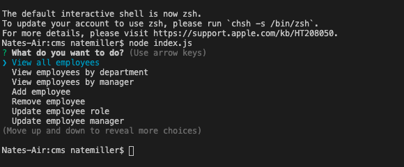

# Content Management System

This application is a command-line employee tracker that allows a user to view and interact with information stored in a database.

## Installation/Usage

To use the application, run an npm i in your command line to install dependencies. Then type "node index.js" in your CLI to initiate the application.

## Technologies

This application uses MySQL for the database, JS for the code and inquirer and console.table.

## Link

To view a video of the application in use go to https://drive.google.com/file/d/1uXQ_IHGZ6icQwSo4UHvKSghSuZqWJLbo/view
